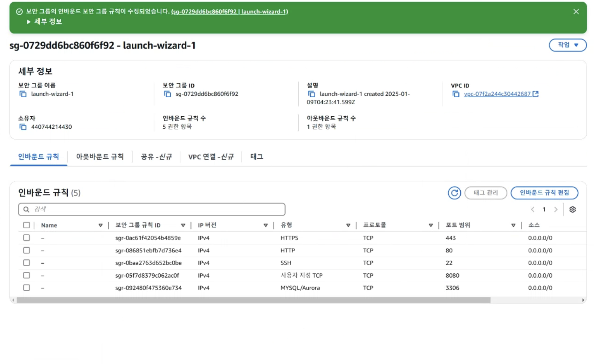
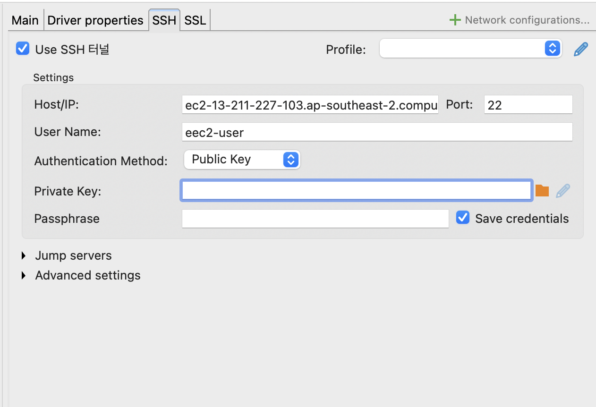

# 🏙 Seoul Tourism

## 1. 소개와 기능
### 1.1 소개
최근 K-POP과 대형 OTT 콘텐츠를 통해 한국에 대한 관심이 급증하며, 방문 외국인 관광객의 수가 꾸준히 늘고 있습니다. 그러나 이들은 실제 여행 계획 단계에서 **"미디어에 소개된 장소 외에는 어디를 가야 할지 모른다"**\는 문제에 부딪힙니다. SNS와 검색 결과에 의존하다 보니 기존 여행객들의 루트를 그대로 따라가는 단편적인 일정이 반복되고, 진정한 한국의 매력을 경험하지 못하는 경우가 많습니다.

**"Seoul Tourism"**\는 이러한 문제를 해결하기 위해 탄생한 맞춤형 관광 플랫폼입니다. 단순히 유명 관광지만 소개하는 것을 넘어, **서울의 숨겨진 자연 경관, 역사적 문화재, 체험형 프로그램, 지역 특색 축제, 테마 거리** 등을 종합적으로 추천합니다. 이를 통해 여행객들은 기성 루트에서 벗어나 다양성과 깊이를 갖춘 한국만의 경험을 만들 수 있습니다.

### 1.2 기능
- 📍 여행지 찜하기: DB와 지도 API를 활용하여 사용자가 원하는 관광지를 저장 및 관리  
- 📆 여행 캘린더: 일정 및 세부 내용을 기록하고 관리하는 캘린더 기능 제공  
- 🛒 굿즈 상품 & 결제: 여행 관련 기념품 및 상품을 구매하고 결제 진행  
- 📊 관광 통계 분석: 공공 데이터 OpenAPI를 활용하여 서울 관광 통계를 제공  
- ⭐ 인기 관광지 추천: 사용자 선호도를 반영한 TOP 5 관광지 추천 기능  
- 🔑 회원가입 & 로그인: JWT 기반 사용자 인증 및 보안 강화 (Spring Security)

### 1.3 팀 구성
#### 팀원 소개 
- [B.E]김도현 
- [B.E]우비주 
- [B.E]안성현 
- [B.E]김보경 


## 2. 개발 환경 및 배포 URL 
### 2.1 개발 환경 

#### 🛠 기술 스택
- Backend: Java 17, Spring Boot 3.x, Spring Security, JPA  
- Database: MariaDB 
- CI/CD: Docker, AWS EC2 
- Authentication: JWT (Spring Security 필터 방식)  
- API: 지도 API, 공공 데이터 OpenAPI 활용  
- Payment: PortOne


### 2.2 배포 URL


Backend
- http://ec2-3-36-66-32.ap-northeast-2.compute.amazonaws.com:8080/
- 테스트용 계정
    ```
    id : bbb@abcdef.com
    pw : super1234!
    ```


### 2.3  URL 구조 

- User

|App|Method|URL|Views Class|Note|Authentication|
|---|---|---|---|---|---|
|seoulTourism|POST|'/auth/email'|Auth|이메일 중복확인||
|seoulTourism|POST|'/auth/signup'|Auth|회원가입||
|seoulTourism|POST|'/auth/login'|Auth|로그인||
|seoulTourism|POST|'/reissue'|Auth|accessToken 재발급 및 refreshToken 갱신||
|seoulTourism|POST|'/logout'|Auth|로그아웃||
|seoulTourism|GET|'/auth/delete'|Auth|회원탈퇴||

- Goods

|App|Method|URL|Views Class|Note|Authentication|
|---|---|---|---|---|---|
|seoulTourism|GET|'/api/goods'|Goods|전체 목록 조회||
|seoulTourism|GET|'/api/goods/category/{category}'|Goods|카테고리별 조회||
|seoulTourism|GET|'/api/goods/{goodId}'|Goods|상세조회||
|seoulTourism|GET|'/api/goods/available'|Goods|판매중인 굿즈 조회||

- Cart

|App|Method|URL|Views Class|Note|Authentication|
|---|---|---|---|---|---|
|seoulTourism|POST|'/cart/add'|Cart|장바구니 담기|✅|
|seoulTourism|GET|'/cart/check'|Cart|장바구니 전체조회|✅|
|seoulTourism|POST|'/cart/update'|Cart|장바구니 수량 조절|✅|
|seoulTourism|DElETE|'/cart/delete'|Cart|장바구니 목록 삭제(단건)|✅|

- Order

|App|Method|URL|Views Class|Note|Authentication|
|---|---|---|---|---|---|
|seoulTourism|POST|'/order/create'|Order|주문 생성|✅|

- Calendar
  
|App|Method|URL|Views Class|Note|Authentication|
|---|---|---|---|---|---|
|seoulTourism|GET|'/calendar/schedule/{userId}?tourStartDate={tourDate}'|Calendar|유저와 투어시작일 기준으로 스케줄 조회|✅|
|seoulTourism|GET|'/calendar/schedule/all/{userId}'|Calendar|유저의 모든 스케줄 조회|✅|
|seoulTourism|DELETE|'/calendar/schedule/{calendarId}?userId={userId}'|Calendar|캘린더 삭제|✅|
|seoulTourism|POST|'/calendar/single'|Calendar|단일 캘린더 생성|✅|
|seoulTourism|GET|'/calendar/multipale'|Calendar|여러 캘린더 생성|✅|
|seoulTourism|GET|'/calendar/dates/{userId}'|Calendar|사용자에 따른 캘린더에 등록된 날짜만 조회|✅|

- Fav-place

|App|Method|URL|Views Class|Note|Authentication|
|---|---|---|---|---|---|
|seoulTourism|POST|'/fav-places/{mapId}/like?userId={userId}'|Fav-place|찜 추가기능||
|seoulTourism|GET|'/fav-places/{userId}'|Fav-place|추가한 찜 장소 내용 보여주기, 찜수 증가||
|seoulTourism|DELETE|'/fav-places/{mapId}/unlike?userId=10'|Fav-place|찜 해체시, 찜수 감소기능 및 찜 삭제||

- Payment

|App|Method|URL|Views Class|Note|Authentication|
|---|---|---|---|---|---|
|seoulTourism|POST|'/payment/process'|Payment|결제처리|✅|
|seoulTourism|GET|'/payment/history'|Payment|결제 내역 조회|✅|
|seoulTourism|POST|'/payment/cancel/{impUid}'|Payment|결제처리|✅|

- Map

|App|Method|URL|Views Class|Note|Authentication|
|---|---|---|---|---|---|
|seoulTourism|GET|'/api/maps'|Map|전체 맵 조회||
|seoulTourism|GET|'/api/maps/{mapId}'|Map|맵 상세조회||
|seoulTourism|POST|'/api/maps/1/new'|Map|찜 토글하기||
|seoulTourism|GET|'/maps/category/{category}'|Map|카테고리별로 맵 조회||

- Statistic
  
|App|Method|URL|Views Class|Note|Authentication|
|---|---|---|---|---|---|
|seoulTourism|GET|'/statistic/genderTop7Population?year={year}&month={month}'|Statistic|방문객(성별)중에서 월별 상위 7개 나라 조회||
|seoulTourism|GET|'/statistic/genderTop7ByYear?year={year}'|Statistic|방문객(성별)중에서 연도별 상위 7개 나라 조회||


## 3. 요구사항 명세와 기능 명세 --> 변경하여 작성

- [https://www.mindmeister.com/](https://www.mindmeister.com/) 등을 사용하여 모델링 및 요구사항 명세를 시각화하면 좋습니다.
- 이미지는 셈플 이미지입니다.

[](https://github.com/weniv/project_sample_repo/blob/main/map.png)

- 머메이드를 이용해 시각화 할 수 있습니다.

## 4. 개발 일정 --> 변경하여 작성

## 데일리 스크럼 시간 : 매일 오후 2시

### 4.1 개발 일정(WBS) --> 변경하여 작성


[](https://github.com/weniv/project_sample_repo/blob/main/wbs_xlsx.png)

- 좀 더 가벼운 프로젝트는 아래 일정표를 사용하세요.
- 아래 일정표는 [habitmaker.co.kr](https://habitmaker.co.kr/) 에서 작성되었습니다.
- 관련된 스택 표시는 [dev.habitmaker.co.kr](https://dev.habitmaker.co.kr/) 에서 작성되었습니다.


## 5. 와이어프레임 / UI / BM --> 변경하여 작성
### 5.1 와이어프레임
- 아래 페이지별 상세 설명, 더 큰 이미지로 하나하나씩 설명 필요

[](https://github.com/weniv/project_sample_repo/blob/main/ui.png)

- 와이어 프레임은 디자인을 할 수 있다면 '피그마'를, 디자인을 할 수 없다면 '카카오 오븐'으로 쉽게 만들 수 있습니다.

### 5.2 화면 설계 ※ 화면은 gif,jpg 파일로 업로드해주세요.

- 표는 가로/세로 상관이 없습니다.

|   |   |
|---|---|
|메인|로그인|
|[](https://github.com/weniv/project_sample_repo/blob/main/ui1.png)|[](https://github.com/weniv/project_sample_repo/blob/main/ui2.png)|
|회원가입|정보수정|
|[](https://github.com/weniv/project_sample_repo/blob/main/ui3.png)|[](https://github.com/weniv/project_sample_repo/blob/main/ui3.png)|
|검색|번역|
|[](https://github.com/weniv/project_sample_repo/blob/main/ui3.png)|[](https://github.com/weniv/project_sample_repo/blob/main/ui3.png)|
|선택삭제|글쓰기|
|[](https://github.com/weniv/project_sample_repo/blob/main/ui3.png)|[](https://github.com/weniv/project_sample_repo/blob/main/ui3.png)|
|글 상세보기|댓글|
|[](https://github.com/weniv/project_sample_repo/blob/main/ui3.png)|[](https://github.com/weniv/project_sample_repo/blob/main/ui3.png)|

## 6. 데이터베이스 모델링(ERD) 및 변수명 --> 변경하여 작성

- 프론트와 백엔드 간에 정보를 주고 받는 과정에서 혼선이 일어나지 않도록 변수명을 설정이 필요합니다.
- 프론트에서 submit과정을 진행할 때 어떤 변수명으로 보내는지 알아야 데이터 맞추기가 수월합니다.

- 아래 ERD는 [ERDCloud](https://www.erdcloud.com/)를 사용했습니다.

[](https://github.com/weniv/project_sample_repo/blob/main/erd.png)

- [https://dbdiagram.io/home도](https://dbdiagram.io/home%EB%8F%84) 많이 사용합니다.

## 7. Architecture --> 변경하여 작성

- 아래 Architecture 설계도는 PPT를 사용했습니다.

[](https://github.com/weniv/project_sample_repo/blob/main/architecture.png)

- PPT로 간단하게 작성하였으나, 아키텍쳐가 커지거나, 상세한 내용이 필요할 경우 [AWS architecture Tool](https://online.visual-paradigm.com/ko/diagrams/features/aws-architecture-diagram-tool/)을 사용하기도 합니다.

## 8. 메인 기능 --> 변경하여 작성
- 머메이드나 이미지 파일을 사용하면 좋을 것 같습니다.
- 요구사항 및 기능 명세에서 제외한 기능을 작성하면 좋을 것 같습니다.
- 예를 들어, 이미지 저장을 위해 Amazon S3를 사용했다. OAuth 기능 구현을 위해 카카오로그인 API를 사용했다. 등등
- 요구사항 및 기능 명세에서 간단하게 설명만 하였다면 구현한 API를 자세하게 설명해도 괜찮습니다.

## 9. 트러블 슈팅
### ec 서버에 MariaDB 서버 설치
  1.디비버 접속 ec2 연결 오류
   1) Access denied for user 'root'@'121.64.137.133' (using password: YES)<br> → MariaDB 서버에 외부에서 접속을 시도할 때 발생하는 권한 문제

해결시도1. AWS 인바운드 보안규칙 설정


해결시도2. SSH로 연결시도


private Key 에 ppk 파일 넣어주면 됨 <br>
→ 하지만 연결 문제 해결되진 않았음

해결시도3. 서버에서 접근 권한 부여
```c
sudo mysql -u root -p select user, host, plugin from user; #(플러그인체크)

USE mysql;
update user set plugin='mysql_native_password' where user='root';

grant all privileges on *.* to '아이디'@'localhost';
#특정 사용자에게 전 권한 부여
grant all privileges on DB명.* to '아이디'@'localhost';
#특정 사용자에게 특정 DB접근권한 부여
FLUSH PRIVILEGES;
(재시동)

ALTER USER 'root'@'localhost' IDENTIFIED WITH mysql_native_password BY '재설정 비밀번호';

select user, host, plugin from user; #호스트 재확인
grant all privileges on *.* to '계정명'@'%'; #권한부여
flush privileges; #재시작

create user '계정명'@'%' identified by 'password'; #'%' 모든 IP 접근 가능 호스트 생성
```
2) dbeaver connection timeout<br>
→ 주로 네트워크 연결, 방화벽 설정, 또는 서버 설정 문제가 원인 <br>
이 부분 에러는 Authentication/username 이 잘못들어가있어서 오류가 뜬걸로 예상됨 <br>
username을 root에서 ec2-user 로 변경해주니 서버 연결됨!

참고자료&블로그<br>

1. AWS EC2에 MariaDB 설치하기
https://saml-planner.com/2024/02/19/aws-ec2%EC%97%90-mariadb-%EC%84%A4%EC%B9%98%ED%95%98%EA%B8%B0/

2.[AWS] EC2 Linux2에 MariaDB 설치 및 데이터 마이그레이션
https://gom20.tistory.com/293

3.dbeaver EC2 Mysql 연결 오류 - 에러메시지별 해결방법
https://velog.io/@nowlee/dbeaver-EC2-Mysql-%EC%97%B0%EA%B2%B0-%EC%98%A4%EB%A5%98-%EC%97%90%EB%9F%AC%EB%A9%94%EC%8B%9C%EC%A7%80%EB%B3%84-%ED%95%B4%EA%B2%B0%EB%B0%A9%EB%B2%95
